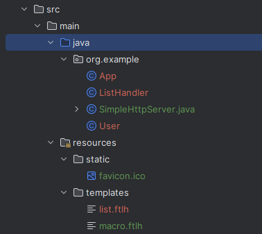

### Нововведения
1) Теперь весь код нахожится в одном файле `SimpleHttpServer.java`
2) Для корректной работы, ваш проект **должен** иметь определенную структуру папок:

    - В папке с проектом должна быть папка `src`
    - папки `java` и `resources` должны находиться на одном уровне
    - В FreeMarker шаблоны должны лежать в папке `templates`
    - Статические файлы (картинки, иконка, html файлы) должны лежать в папке `static`
    - менять названия папок **нельзя**
3) Код для создания сервера немного изменился, теперь нужно создавать объект `new SimpleHttpServer()`:
```java
public class App {
    public static void main(String[] args) throws IOException {
        SimpleHttpServer server = new SimpleHttpServer();
        server.createContext("/list", new ListHandler(List.of(new User("1", "2"), new User("3", "4"))));

        server.run();
    }
}
```
4) Метод `params()` теперь можно вызывать многократно
5) В файле `pom.xml` нужно указывать freemarker в зависимостях 
